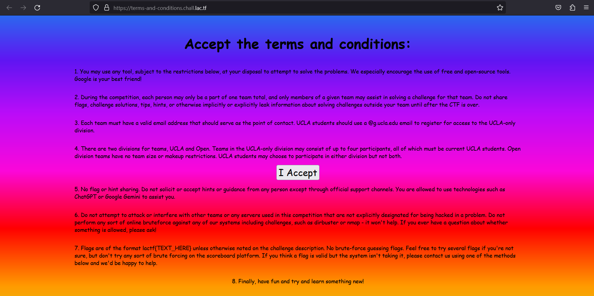
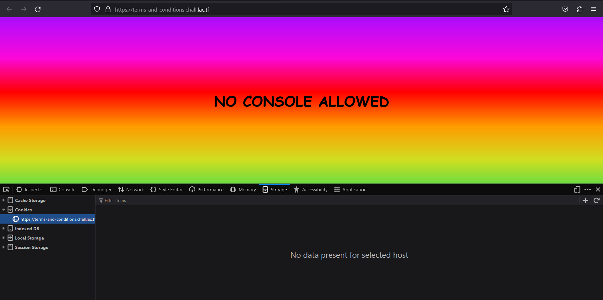
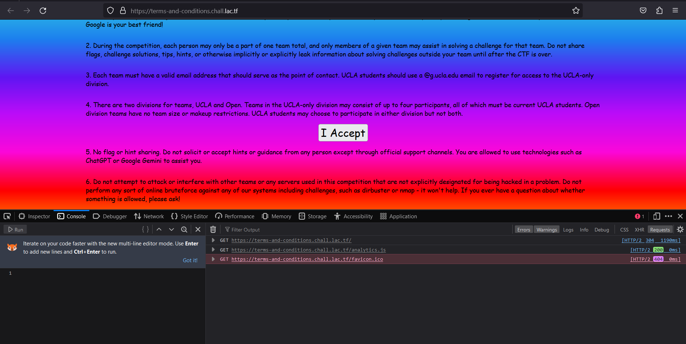
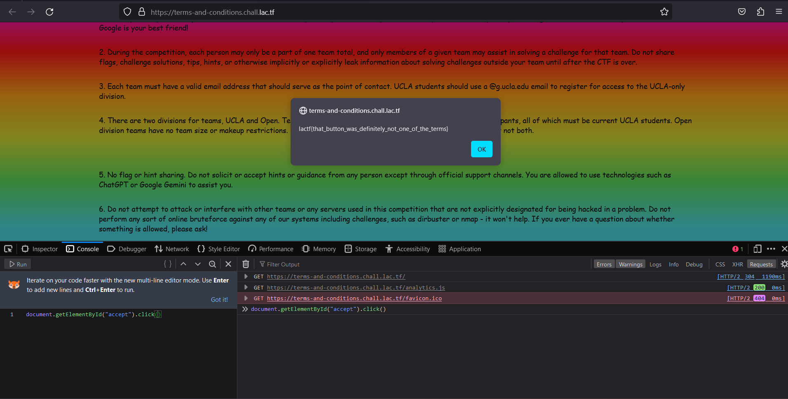

* 771 solves / 106 points
* author: aplet123

## Description

> Welcome to LA CTF 2024! All you have to do is accept the terms and conditions and you get a flag!
>
> [terms-and-conditions.chall.lac.tf](https://terms-and-conditions.chall.lac.tf/)

### Attached

[term-and-conditions.html](attached/terms-and-conditions.html)

## Analyzation

Let's visit the site



The button, for sure, cannot be clicked by mouse. It must be "clicked" by console.

But when the console is opened, the site becomes blank and...



Look up in the source code, this is reason why

```js
let width = window.innerWidth;
let height = window.innerHeight;
setInterval(function() {
    if (window.innerHeight !== height || window.innerWidth !== width) {
        document.body.innerHTML = "<div><h1>NO CONSOLE ALLOWED</h1></div>";
        height = window.innerHeight;
        width = window.innerWidth;
    }
}, 10);
```

## Solution

It only does that if the dimensions of the window changes after it loads.

So let's just leave the console there and refresh, and the console is on.



Then run the js command

```js
document.getElementById("accept").click()
```



The flag is
```
lactf{that_button_was_definitely_not_one_of_the_terms}
```